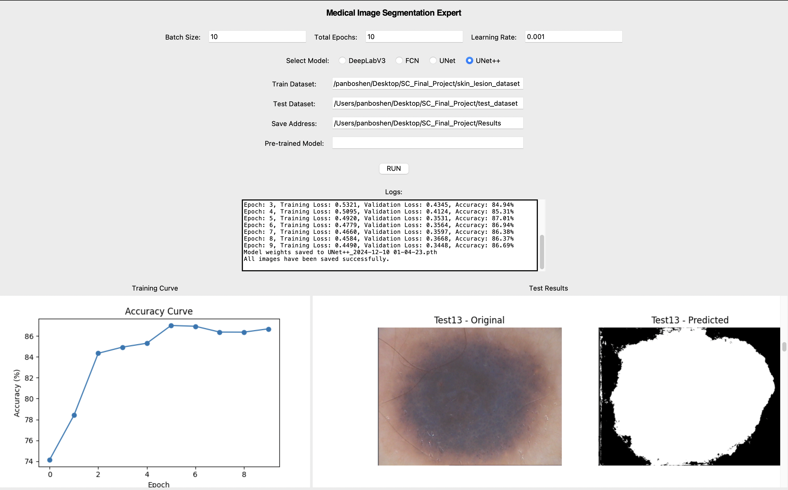

# Medical Image Segmentation Expert

A GUI-based medical image segmentation tool supporting various models like DeepLabV3, FCN, UNet, and UNet++. The application provides an easy-to-use interface for training and inference, making it ideal for medical imaging projects.

## 🛠️ Features

- **User-Friendly GUI**: Intuitive interface for setting parameters, selecting models, and managing datasets.
- **Support for Multiple Models**: Choose from DeepLabV3, FCN, UNet, or UNet++ for segmentation tasks.
- **Flexible Training & Inference**:
  - Load pre-trained `.pth` weights to skip training.
  - Train models from scratch if no pre-trained weights are provided.
- **Dynamic Parameter Input**:
  - Configure **Epoch**, **Batch Size**, and **Learning Rate** interactively.
  - Real-time log updates for monitoring progress.
- **Visualization**:
  - Training accuracy curve displayed after training.
  - Test results are stitched into a single scrollable image for easy inspection.

---

## 📦 Requirements

- **Python**: 3.8 or newer
- **Dependencies**:
  ```bash
  pip install torch torchvision matplotlib pillow numpy
  ```

---

## 📂 Directory Structure

Ensure the following structure for proper functioning:

```plaintext
Medical_Image_Segmentation/
|-- final_project.py        # Main GUI application
|-- DeepLabV3.py            # DeepLabV3 model definition
|-- FCN.py                  # FCN model definition
|-- UNet.py                 # UNet model definition
|-- UNet++.py               # UNet++ model definition
|-- README.md               # Project documentation
|-- GUI_example.png         # Screenshot of the GUI
|-- pretrained_models/      # Pre-trained models
|   |-- DeepLabV3_2024-12-09_10-56-09.pth
|   |-- FCN_2024-12-09_23-41-37.pth
|   |-- UNet_2024-12-09_23-50-41.pth
|   |-- UNet++_2024-12-10_01-04-23.pth
|-- dataset/                # Folder for datasets
    |-- skin_lesion_dataset/ # Training dataset
    |-- test_dataset/        # Test dataset
```

---

## 📑 Dataset and Pre-trained Models

1. **Training Dataset**:
   - A folder (e.g., `skin_lesion_dataset`) containing subdirectories (e.g., `IMD...`), each with:
     - Dermoscopic images
     - Corresponding lesion masks.

2. **Test Dataset**:
   - A folder (e.g., `test_dataset`) containing subdirectories (e.g., `Test01`, `Test02`), each with `.bmp` images (no masks required).

3. **Pre-trained Models**:
   - Pre-trained models for DeepLabV3, FCN, UNet, and UNet++ are included for inference without training.

**Access Dataset and Pre-trained Models**:  
[Google Drive Link](https://drive.google.com/drive/folders/1jXeejsBN_O1_mSY7S0zUFZuyRUKbSrg5?usp=sharing)

---

## 🚀 Usage

### 1. Run the GUI
Launch the application by running the following command:
```bash
python final_project.py
```

### 2. Configure Parameters
Set the desired parameters in the GUI:
- **Batch Size**, **Total Epochs**, and **Learning Rate**: Enter appropriate values.
- **Model Selection**: Choose from DeepLabV3, FCN, UNet, or UNet++.
- **Train Dataset**: Provide the path to your training dataset.
- **Test Dataset**: Provide the path to your test dataset.
- **Save Address**: Specify an empty folder to save results.
- **Pre-trained Model** *(optional)*: Load `.pth` weights to skip training or leave blank to train from scratch.

### 3. Run
Click the `RUN` button to start:
- If no pre-trained model is provided, the application will train the model, display logs, and show the accuracy curve.
- After training or loading weights, inference is performed on the test dataset.

---

## 📊 Results

- **Training Accuracy Curve**: Displayed in the left panel of the GUI after training.
- **Test Results**: Stitched test result images appear in the right panel and can be scrolled for inspection. Individual results are saved in the specified directory.

Below is an example screenshot after running inference:



---

## 📝 Notes

- Ensure the **Save Address** directory is empty before running.
- Adjust parameters like Epochs, Batch Size, and Learning Rate for optimal training outcomes.
- Logs update in real time to indicate progress.
- If a GPU is available, PyTorch will utilize it automatically for faster processing.

Feel free to contribute or raise issues. Happy segmenting! 😊
